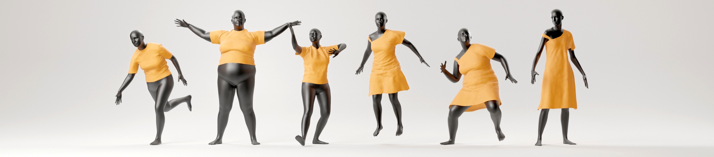
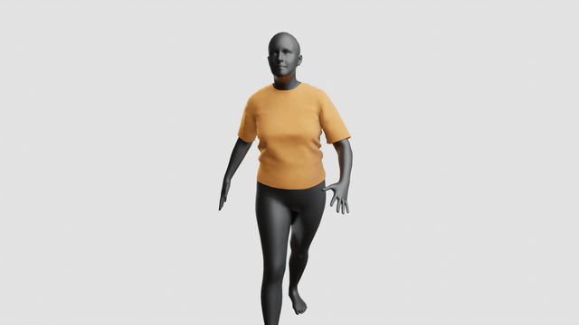

# Self-Supervised Collision Handling via Generative 3D Garment Models for Virtual Try-On



[[Project website](http://mslab.es/projects/SelfSupervisedGarmentCollisions/)] [[Dataset](https://github.com/isantesteban/vto-dataset)] [[Video](https://youtu.be/9AnBNco6i2U)]

## Abstract

>We propose a new generative model for 3D garment deformations that enables us to learn, for the first time, a data-driven method for virtual try-on that effectively addresses garment-body collisions. In contrast to existing methods that require an undesirable postprocessing step to fix garment-body interpenetrations at test time, our approach directly outputs 3D garment configurations that do not collide with the underlying body. Key to our success is a new canonical space for garments that removes pose-and-shape deformations already captured by a new diffused human body model, which extrapolates body surface properties such as skinning weights and blendshapes to any 3D point. We leverage this representation to train a generative model with a novel self-supervised collision term that learns to reliably solve garment-body interpenetrations. We extensively evaluate and compare our results with recently proposed data-driven methods, and show that our method is the first to successfully address garment-body contact in unseen body shapes and motions, without compromising realism and detail. 


# Running the model

**Requirements**: ```python3.8```, ```tensorflow-2.2.1```, ```numpy-1.18.5```, ```scipy-1.7.1```, ```chumpy-0.70```

**Project structure**:
```
vto-garment-collisions
│
└───assets 
|    └─ images    
|    └─ meshes    
|    └─ CMU       # Not included, see instructions
|    └─ SMPL      # Not included, see instructions
| 
└───rendering     # Code to render meshes 
|
└───src           # Code to run the model
| 
└───trained_models      
|    └─ diffused_body  # Networks of the diffused body model (Not included, see instructions)
|    └─ tshirt         # Networks of tshirt model (Not included, see instructions)
│
└───run_model.py
```

## Download trained models

1. Download models of the diffused human body: https://github.com/isantesteban/vto-garment-collisions/releases/download/trained-models/trained_models_diffused_body.zip
2. Download models of the garment: https://github.com/isantesteban/vto-garment-collisions/releases/download/tshirt-trained-models/trained_models_tshirt.zip
3. Create ```trained_models``` directory and extract ```trained_models_diffused_body.zip``` and ```trained_models_tshirt.zip``` there.

## Download human model

1. Sign in into https://smpl.is.tue.mpg.de
2. Download SMPL version 1.0.0 for Python 2.7 (10 shape PCs)
3. Extract ```SMPL_python_v.1.0.0.zip``` and copy ```smpl/models/basicModel_f_lbs_10_207_0_v1.0.0.pkl``` in ```assets/SMPL```

## Download animation sequences

1. Sign in into https://amass.is.tue.mpg.de
2. Download the body data for the CMU motions (SMPL+H model)
3. Extract ```CMU.tar.bz2``` in ```assets/CMU```:  
```sh
tar -C assets/ -xf ~/Downloads/CMU.tar.bz2 CMU/ 
```

## Generate garment animation

To generate the deformed garment meshes for a given sequence:

```sh
python run_model.py assets/CMU/07/07_02_poses.npz --export_dir results/07_02
```


# Rendering
**Requirements**: ```blender-2.93```, ```ffmpeg```

To render the meshes:

```sh
blender --background rendering/scene.blend --python rendering/render.py --path results/07_02
```



# Citation

If you find this repository useful please cite our work:

```
@article {santesteban2021garmentcollisions,
    journal = {IEEE/CVF Conference on Computer Vision and Pattern Recognition (CVPR)},
    title = {{Self-Supervised Collision Handling via Generative 3D Garment Models for Virtual Try-On}},
    author = {Santesteban, Igor and Thuerey, Nils and Otaduy, Miguel A and Casas, Dan},
    year = {2021}
}
```

